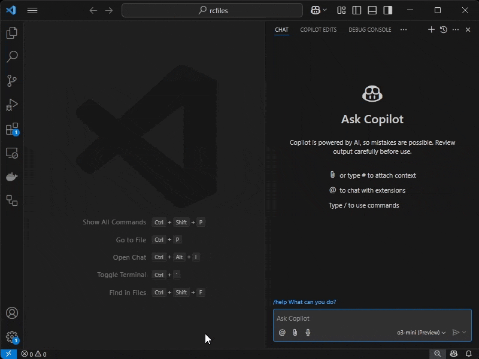
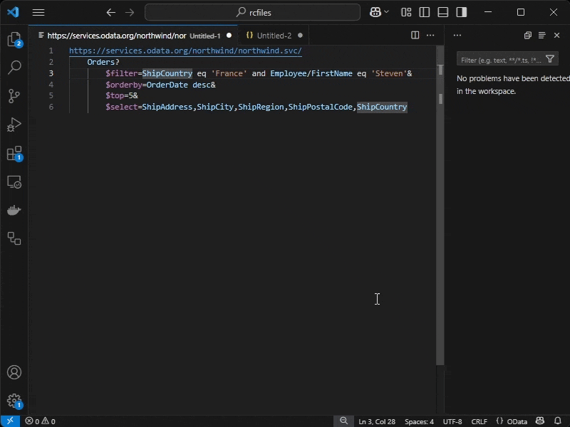

# OData support for VSCode

> OData query language support for VSCode. Write and run queries with syntax highlighting, metadata-aware auto-completion, and Copilot integration.

## Features

### Copilot integration: Talk to your OData service

### Metadata-aware code completion and diagnostics

### More Features
- Syntax highlighting and formatting for OData queries
- Endpoint profiles with authentication and custom headers
- Run queries directly in VSCode and get code-formatted results

## Setup

Minimal setup to enable Metadata-aware completion and Copilot integration:
- Open view `OData Endpoint Profile` or run command `OData: Add Endpoint Profile`
- Add a new profile
- Request metadata for the profile

In Copilot Chat, chat with participant `@odata`, example: 

> **@odata** give me all Workitems assigned to John Doe in status New

## Commands

| Name | Description |
| ----- | ----- |
| `odata.run`          | Send query in ActiveTextEditor to selected profile  |
| `odata.addProfile` | Add a new endpoint profile. _Start here_ |
| `odata.selectProfile` | Select an endpoint profile |
| `odata.getMetadata` | Download the metadata for the selected profile. _Use this to test if your endpoint authentication works_ |

## Settings

| Setting                        | Description                                                                                  | Default Value |
|--------------------------------|----------------------------------------------------------------------------------------------|---------------|
| `odata.defaultFormat`          | Set the default response format | `json`       |
| `odata.metadata.removeAnnotations` | Removes annotations from metadata to reduce size. | `false`       |
| `odata.metadata.filterNs`      | List of non-EDMX namespaces to filter out from metadata.  | `[]`          |
| `odata.strictParser`           | Whether to show query syntax errors as warnings (`false`) or errors (`true`). | `true`        |

## Known Issues and Limitations

Supported HTTP authentication with OData endpoints: 
- Basic
- Client Certificate
- Bearer token (copy / paste)

Metadata-aware diagnostics and auto-completion only works for top-level entities and some expand entities. Complex nested queries like `?$expand=Entity($select=Prop1,Prop2)` are not supported for metadata-awareness. 

Specials paths like `/$metadata`, `/$count` don't show errors, but the parsed query will be off and metadata-awareness won't work. 

## Troubleshooting

### Endpoint authentication method is not supported

You can still use all features but the query runner. Create an endpoint profile with your service URL and manually copy the metadata into the profile. Syntax highlighting, metadata-aware completion, and Copilot integration will work. 

### Metadata file too large

Github Copilot has a character limit for requests. If your service metadata is above that, Copilot will refuse the request. Options:
- If your metadata includes annotations, enable `odata.metadata.removeAnnotations` in settings to filter all annotations from metadata
- If your metadata includes non-EDMX namespaces, maintain them in `odata.metadata.filterNs` to filter them out
- Manually shorten your metadata file in profiles, for example remove entity definitions you are not working with

## Acknowledgment

This extension is modeled after https://github.com/StanislawSwierc/vscode-odata.

The OData syntax definition created by [Geoff Cox (@GeoffCox)](https://github.com/GeoffCox) is reused from vscode-odata. 

The EDMX parser is a modified version of https://github.com/odata2ts/odata2ts by [@texttechne](https://github.com/texttechne).