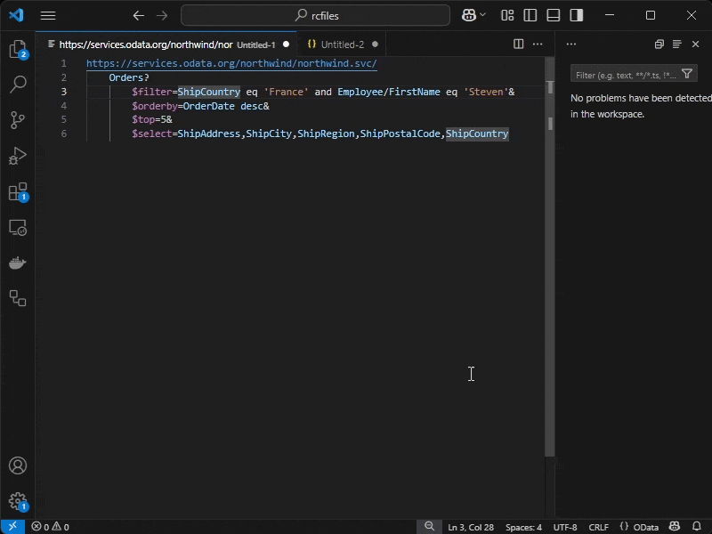

# OData support for VSCode

> OData query language support for VSCode. Write and run queries with syntax highlighting, metadata-aware auto-completion, and Copilot integration.

## Features

### Copilot integration: Talk to your OData service

### Metadata-aware code completion and diagnostics

### More Features
- Syntax highlighting and formatting for OData queries
- Diagnostics for syntax errors and for resources, properties, functions and query options your service does not know
- Supports OData V2 and V4 / 4.01 query syntax, including `$apply`, `$compute`, `$search` and lambda expressions
- Endpoint profiles with authentication and custom headers
- Run queries directly in VSCode and get code-formatted results

## Setup

Minimal setup to enable Metadata-aware completion and Copilot integration:
- Open view `OData Endpoint Profile` or run command `OData: Add Endpoint Profile`
- Add a new profile
- Request metadata for the profile

In Copilot Chat, chat with participant `@odata`, example: 

> **@odata** give me all Workitems assigned to John Doe in status New

## Commands

| Name                  | Description                                                                 |
|-----------------------|-----------------------------------------------------------------------------|
| `odata.run`           | Send query in active text editor to the selected profile                     |
| `odata.copy`          | Copy the combined, single-line query to clipboard                          |
| `odata.addProfile`    | Add a new endpoint profile. _Start here_                                   |
| `odata.selectProfile` | Select an endpoint profile                                                 |
| `odata.getMetadata`   | Download the metadata for the selected profile. _Use this to test if your endpoint authentication works_ |

## Settings
| Setting                        | Description                                                                                  | Default Value |
|--------------------------------|----------------------------------------------------------------------------------------------|---------------|
| `odata.defaultFormat`          | Set the default response format                                                              | `json`        |
| `odata.metadata.filterNs`      | List of non-EDMX namespaces to filter out from metadata.                                     | `[]`          |
| `odata.metadata.filterXPath`   | List of xpath expressions. Matching elements or attributes will be filtered out.             | `["//edm:Annotation"]` |
| `odata.metadata.xpathDefaultNsPrefix` | A prefix for the default namespace (usually on &lt;Schema&gt;) used in your XPath expression | `edm`          |
| `odata.strictParser`           | Whether to show query syntax errors as warnings (`false`) or errors (`true`).               | `true`        |
| `odata.disableRunner`          | Disable the query runner, for example if your authentication is not supported.               | `false`       |
| `odata.openResultInNewPane`    | Open result document in new pane when running queries. Disable to open results in active view.  | `true`        |

## Known Issues and Limitations

Supported HTTP authentication with OData endpoints: 
- Basic
- Client Certificate
- Bearer token (copy / paste)

Metadata-aware diagnostics and auto-completion follow the query at any depth: nested `$expand` and `$select` options, navigation and complex property paths, type casts, `any`/`all` lambda expressions, `$apply`, and special paths like `/$count`, `/$value` and `/$metadata`. What they do not cover:

- Value types are not checked. `Price eq 'abc'` gives no warning, and members of enumeration literals are not validated.
- After `$apply`, names are checked against the original type plus all aliases of the transformations. A property that `groupby` or `aggregate` removed from the result is not reported.
- Without a selected profile the service root is guessed from the shape of the URL. A singleton or parameterless operation followed by a navigation path (`/Me/Friends`) is only recognized with metadata.
- Duration literals need the `duration'P1D'` form. The bare form `P1D` of OData 4.01 is read as a property name.
- The formatter breaks lines at the resource path and at top-level query options only.

## Troubleshooting

### Corporate proxy / TLS inspection block requests

For a TLS inspection proxy, set `NODE_EXTRA_CA_CERTS` to the certificate authority file before you start VS Code.

### Endpoint authentication method is not supported

You can still use all features but the query runner. Create an endpoint profile with your service URL and manually copy the metadata into the profile. Syntax highlighting, metadata-aware completion, and Copilot integration will work. 

### Metadata file too large

Github Copilot has a character limit for requests. If your service metadata is above that, Copilot will refuse the request. Options:
- If your metadata includes non-EDMX namespaces, maintain them in `odata.metadata.filterNs` to filter them out
- Filter out parts of the metadata document you don't need with xpath expressions in `odata.metadata.filterXPath`
- Manually shorten your metadata file in profiles, for example remove entity definitions you are not working with

## Acknowledgment

This extension is modeled after https://github.com/StanislawSwierc/vscode-odata.

The OData syntax definition created by [Geoff Cox (@GeoffCox)](https://github.com/GeoffCox) is reused from vscode-odata. 

The EDMX parser is a modified version of https://github.com/odata2ts/odata2ts by [@texttechne](https://github.com/texttechne).
